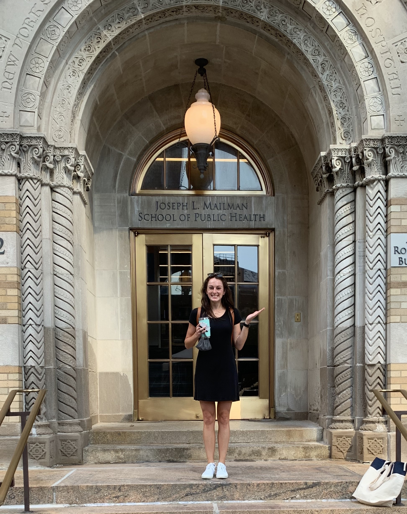
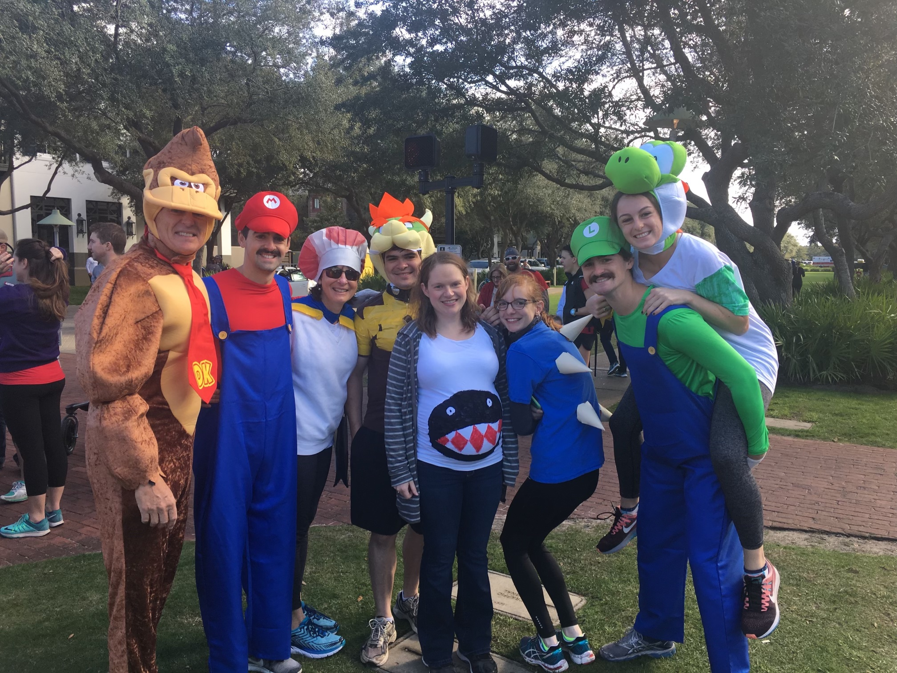

# Hi, I'm Christie 

My name is Christie Zettler, and I am a second-year MPH student at Columbia's [Mailman School of Public Health](https://www.publichealth.columbia.edu/). I am taking a Data Science course, [p8105](https://www.p8105.com/) this semester. 

## Personal Background 

I have lived in New York for just over five years, working previously for a health tech company and a healthcare consulting firm. I am from Memphis, TN, and I have three older brothers. Here's a photo of my family: 

